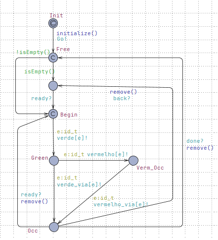

# Projeto Onda Verde do Professor Kyller

## Descrição

Este projeto apresenta uma modelagem detalhada de um sistema de semáforos otimizado na ferramenta UPPAAL. O cenário é baseado no trajeto real entre o posto de gasolina em frente à UFCG (Universidade Federal de Campina Grande) e o estabelecimento Rota Universitária. A meta é sincronizar os semáforos de tal maneira que um veículo, ao percorrer a rota a uma velocidade média de 40 km/h, seja obrigado a parar no máximo uma vez devido à sinalização vermelha.

## Estrutura do Projeto

O sistema é dividido em dois componentes principais modelados no UPPAAL:

1. **Via**: Representa o motorista navegando pelo trajeto, reagindo adequadamente aos sinais dos semáforos.
2. **Semáforo**: Simula o comportamento de um semáforo comum com três estados - verde, amarelo e vermelho - e gerencia a transição entre esses estados.
3. **Controlador**: Coordena a operação dos semáforos e a via, gerenciando as transições entre os estados.

### Arquivos do Projeto

- `ondaVerde.xml`: Arquivo XML que contém todo o modelo do sistema criado no UPPAAL, pronto para ser simulado e verificado.

## Modelagem do Sistema

### Via


Representa a estrada pela qual um carro se move, passando por cada semáforo. O carro começa a se movimentar quando o controlador inicializa e envia o comando `Go`. A partir daí, ele segue o caminho até os semáforos afim de chegar ao seu destino final.

### Semáforo


O template do semáforo modela o ciclo de vida típico de um semáforo urbano. Cada estado representa uma luz do semáforo, com transições temporizadas que mudam de verde para amarelo, e de amarelo para vermelho, num ciclo contínuo. Essa modelagem é fundamental para sincronizar a "onda verde", que permite a passagem do veículo com o mínimo de paradas. Existe uma transição `back` que serve para resetar todo o sistema quando o veículo chegar no **Rota** e evitar *Deadlock*.

### Controlador 



O autômato **Controlador** tem como principal objetivo coordenar o funcionamento dos semáforos e a via, garantindo uma sincronização adequada entre eles. Ele gerencia a fila de controladores, adiciona e remove controladores conforme necessário, e emite sinais para sincronizar as operações dos semáforos e da via. Especificamente, o controlador garante que os semáforos operem em uma sequência que permita um fluxo de tráfego eficiente e seguro, bem como realiza resets no sistema conforme necessário.

O autômato Controlador possui os seguintes estados principais:

1. **Init**: Estado inicial onde o controlador é inicializado.
2. **Free**: Estado onde o controlador verifica se a fila está vazia.
3. **Begin**: Estado onde o controlador se prepara para a operação dos semáforos.
4. **Green**: Estado onde o controlador ativa os semáforos verdes.
5. **Verm_Occ**: Estado onde o controlador sinaliza a ocupação do semáforo vermelho.
6. **Occ**: Estado de ocupação, aguardando a transição.
7. **Done**: Estado final onde o controlador reseta os semáforos.

O controlador utiliza vários sinais para sincronização:

- **done!**: Sinaliza a conclusão de uma operação.
- **ready?**: Aguardando que os semáforos estejam prontos.
- **reset!**: Reseta todos os semáforos ao estado inicial (vermelho).
- **verde[id]!** e **vermelho[id]!**: Sinais para mudar o estado dos semáforos para verde ou vermelho.

1. **Inicialização (`Init`)**: 
   - O controlador chama a função `initialize()` para configurar a fila de controladores com base nas prioridades definidas.
   - Emite o sinal `Go!` para iniciar o processo.

2. **Verificação da Fila (`Free`)**:
   - O controlador verifica se a fila está vazia utilizando `isEmpty()`.
   - Se a fila não estiver vazia, move para o estado `Begin`.

3. **Preparação (`Begin`)**:
   - O controlador emite o sinal `ready?` e aguarda a resposta.
   - Adiciona o controlador na fila com `add(id)`.

4. **Operação dos Semáforos (`Green`)**:
   - Emite o sinal `verde[id]!` para ativar o semáforo verde.
   - Aguardar o sinal `done?` para continuar.

5. **Ocupação do Semáforo Vermelho (`Verm_Occ`)**:
   - Emite o sinal `vermelho[id]!` para ativar o semáforo vermelho.
   - Se prepara para transitar para o estado de ocupação.

6. **Estado de Ocupação (`Occ`)**:
   - Aguardar a transição necessária, removendo o controlador da fila utilizando `remove()`.

7. **Finalização (`Done`)**:
   - Emite o sinal `reset!` para resetar todos os semáforos ao estado inicial.
   - Retorna ao estado inicial (`Init`) para reiniciar o processo.
  
## Funções
### Declarações Globais

```cpp
clock time;
const int N = 4; // Número de semáforos
typedef int[0, N-1] id_t; // Semáforos
typedef int[0,N-1] pid_t; // Controlador

chan verde[N], vermelho[N], verde_via[N], vermelho_via[N];
chan done, ready, run, Go;
broadcast chan back;

// Tempos, em segundos, estimados de chegada em cada semáforo baseado na distância e na velocidade
int tChegSem1 = 108; 
int tChegSem2 = 120;
int tChegSem3 = 134;
int tChegSem4 = 149;
int tChegRota = 157;

const int tVerde = 20; 
const int tAmarelo = 3;
const int tVermelho = 30;

const int P[pid_t] = {0,1,2,3}; // Prioridades

// Task queue
pid_t queue[pid_t];
int[0,N] len = 0;
```

### Funções Utilitárias

#### Inicialização da Fila

A função `initialize()` ordena as tarefas na fila com base nas prioridades.

```cpp
void initialize()
{
  bool picked[pid_t];
  for(i : pid_t)
  {
    int max = 4, t = -1;
    for(j : pid_t)
    {
      if (!picked[j] && P[j] < max)
      {
        max = P[j];
        t = j;
      }
    }
    picked[t] = true;
    queue[i] = t;
  }
}
```

#### Cabeça da Fila

Retorna o primeiro controlador na fila.

```cpp
pid_t head() { return queue[0]; }
```

#### Verifica se a Fila está Vazia

```cpp
bool isEmpty() { return len == 0; }
```

#### Adiciona um Controlador na Fila

Adiciona um controlador na fila e mantém a ordenação por prioridade.

```cpp
void add(pid_t id)
{
  pid_t i, tmp;
  queue[len] = id;
  for(i = len ; i > 0 && P[queue[i]] < P[queue[i-1]]; --i)
  {
    tmp = queue[i];
    queue[i] = queue[i-1];
    queue[i-1] = tmp;
  }
  len++;
}
```

#### Remove um Controlador da Fila

Remove o primeiro controlador da fila e reorganiza a fila.

```cpp
void remove()
{
    int i;
    int first = queue[0];
    for(i = 0; i + 1 < N; ++i) 
    { 
      queue[i] = queue[i + 1]; 
    }
    queue[N - 1] = first;
    len = 0;
}
```

## Trajeto

### Mapa do Trajeto


A imagem do mapa ilustra o trajeto real com a localização dos quatro semáforos. Esta visualização ajuda a compreender a distribuição geográfica dos semáforos e a importância da sincronização para a eficácia da onda verde.

### Ilustração do Problema


A ilustração detalha as distâncias entre os semáforos e a velocidade média necessária para que o veículo atinja o objetivo da onda verde. É uma representação visual do desafio a ser enfrentado na modelagem do sistema.

## Simulação e Verificação

Para observar o comportamento do sistema e verificar a eficácia da onda verde, carregue o arquivo `ondaVerde.xml` no UPPAAL. Utilize as ferramentas de simulação para testar cenários variados e a ferramenta de verificação de modelo para garantir que o sistema atende aos requisitos de design.

## Documentação

Este README é acompanhado por documentação interna dentro do arquivo XML, detalhando cada componente do modelo. Explore a documentação para entender melhor o funcionamento do sistema.
