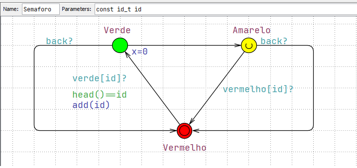

# Projeto Onda Verde do Professor Kyller

## Descrição

Este projeto apresenta uma modelagem detalhada de um sistema de semáforos otimizado na ferramenta UPPAAL. O cenário é baseado no trajeto real entre o posto de gasolina em frente à UFCG (Universidade Federal de Campina Grande) e o estabelecimento Rota Universitária. A meta é sincronizar os semáforos de tal maneira que um veículo, ao percorrer a rota a uma velocidade média de 40 km/h, seja obrigado a parar no máximo uma vez devido à sinalização vermelha.

## Estrutura do Projeto

O sistema é dividido em dois componentes principais modelados no UPPAAL:

1. **Veículo**: Representa o motorista navegando pelo trajeto, reagindo adequadamente aos sinais dos semáforos.
2. **Semáforo**: Simula o comportamento de um semáforo comum com três estados - verde, amarelo e vermelho - e gerencia a transição entre esses estados.

### Arquivos do Projeto

- `ondaVerde.xml`: Arquivo XML que contém todo o modelo do sistema criado no UPPAAL, pronto para ser simulado e verificado.

## Modelagem do Sistema

### Veículo

O template do veículo é construído com vários estados que representam as ações de condução e espera. O estado `Conduzindo` é a ação padrão, que é alterada para `Esperando` sempre que o veículo encontra um sinal vermelho. Esse modelo permite simular a decisão do motorista de parar ou continuar com base no estado do semáforo à frente.

### Semáforo

O template do semáforo modela o ciclo de vida típico de um semáforo urbano. Cada estado representa uma luz do semáforo, com transições temporizadas que mudam de verde para amarelo, e de amarelo para vermelho, num ciclo contínuo. Essa modelagem é fundamental para sincronizar a "onda verde", que permite a passagem do veículo com o mínimo de paradas.

## Trajeto

### Mapa do Trajeto

A imagem do mapa ilustra o trajeto real com a localização dos quatro semáforos. Esta visualização ajuda a compreender a distribuição geográfica dos semáforos e a importância da sincronização para a eficácia da onda verde.

### Ilustração do Problema

A ilustração detalha as distâncias entre os semáforos e a velocidade média necessária para que o veículo atinja o objetivo da onda verde. É uma representação visual do desafio a ser enfrentado na modelagem do sistema.

## Simulação e Verificação

Para observar o comportamento do sistema e verificar a eficácia da onda verde, carregue o arquivo `ondaVerde.xml` no UPPAAL. Utilize as ferramentas de simulação para testar cenários variados e a ferramenta de verificação de modelo para garantir que o sistema atende aos requisitos de design.

## Documentação

Este README é acompanhado por documentação interna dentro do arquivo XML, detalhando cada componente do modelo. Explore a documentação para entender melhor o funcionamento do sistema.
